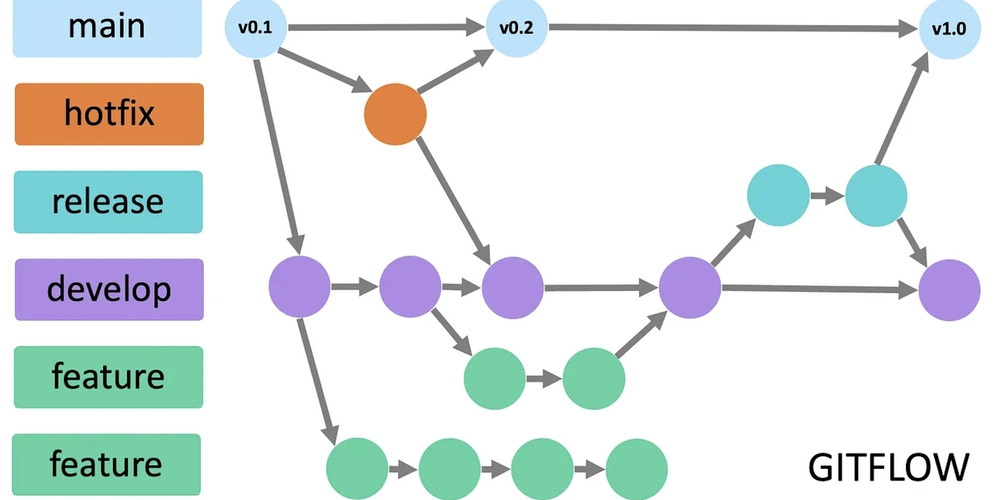
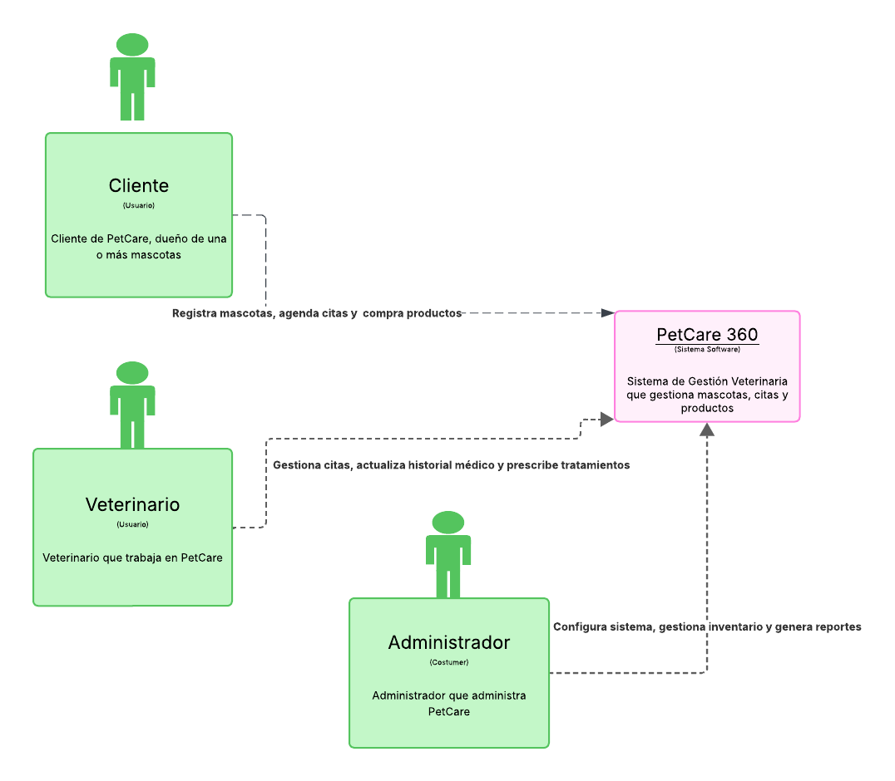
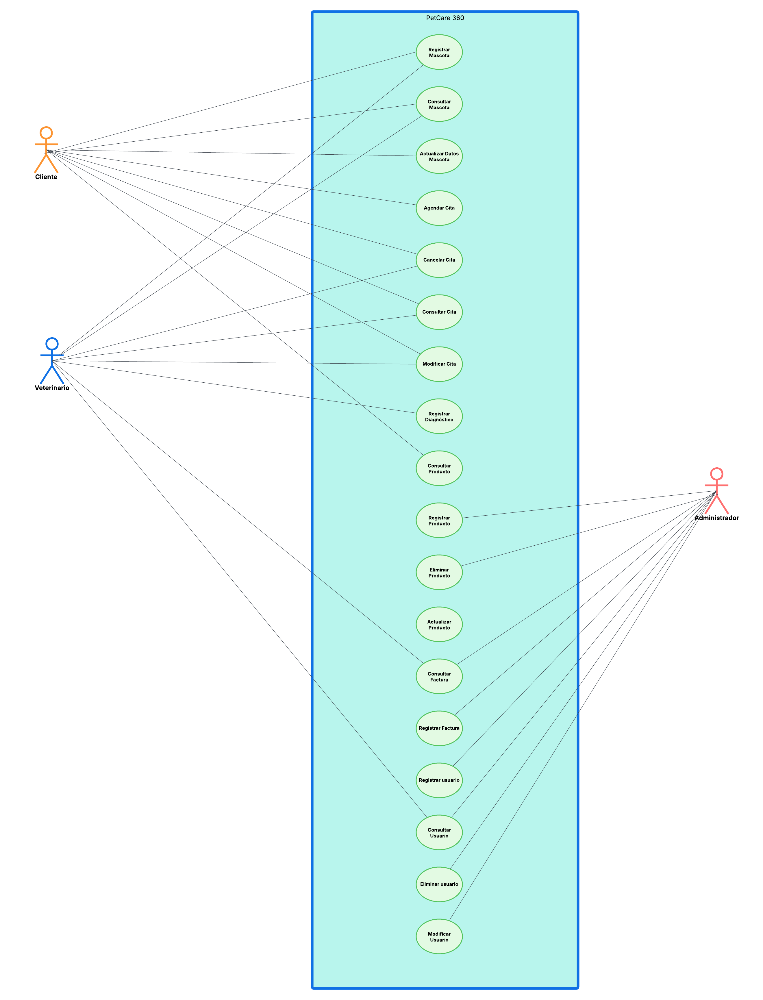
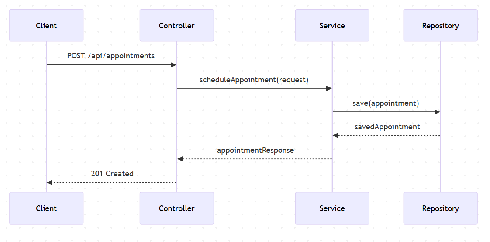
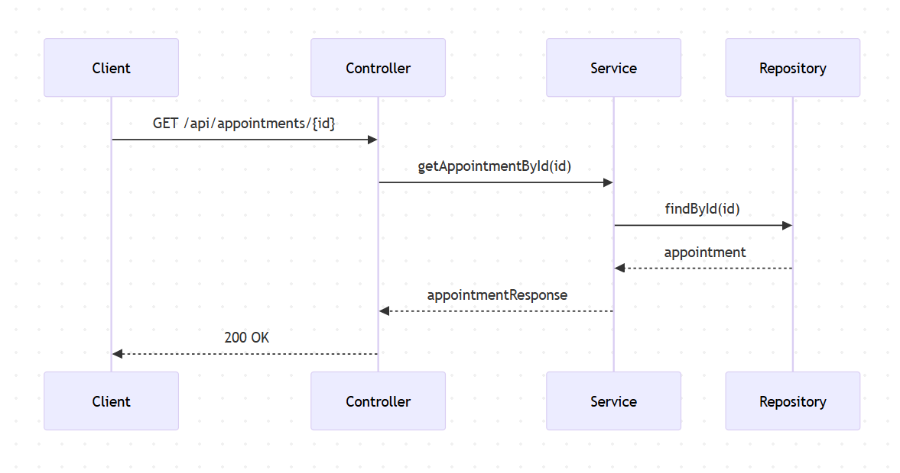
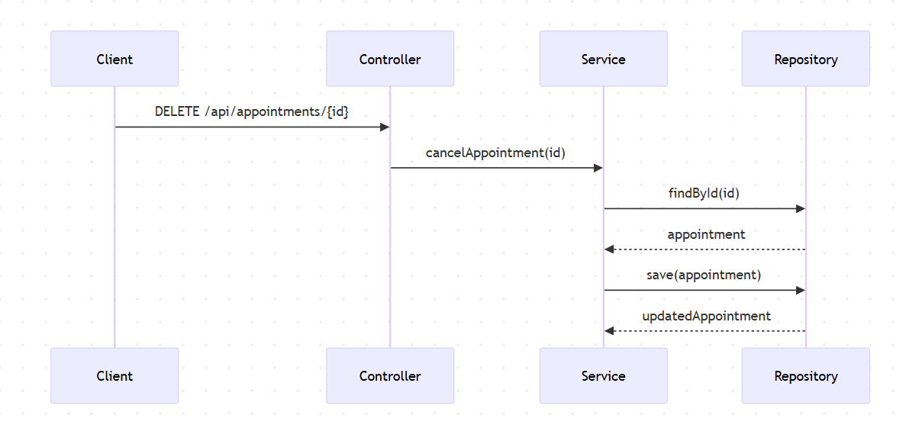
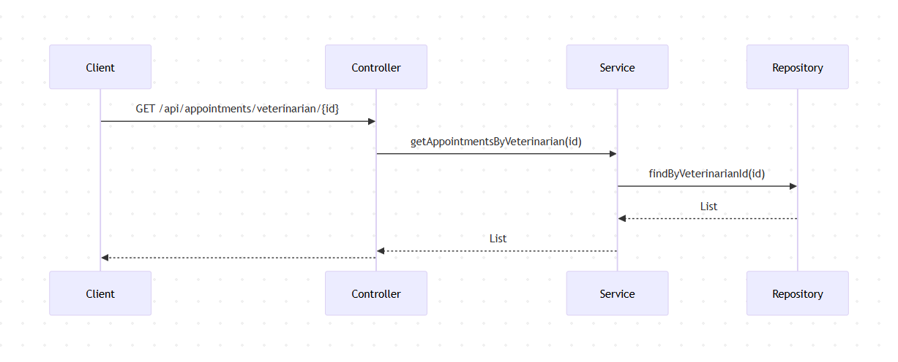
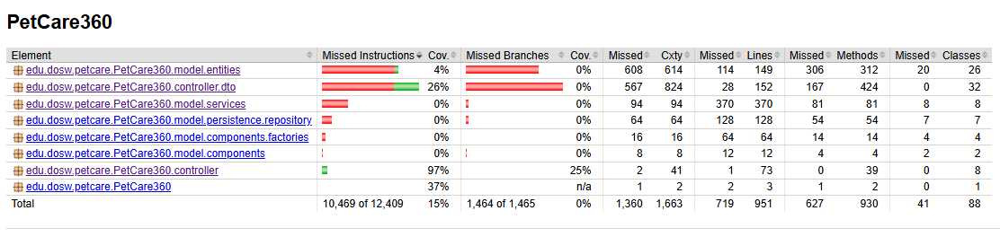
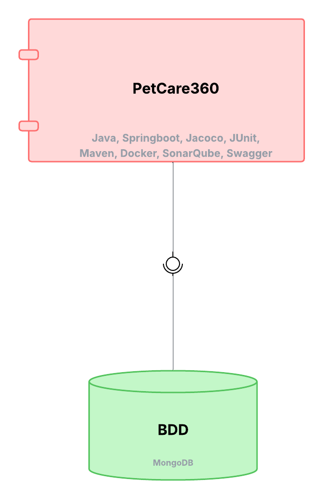

# PetCare360


Sistema de Gestión Veterinaria que gestiona mascotas, citas y productos


### Juan Pablo Contreras

---

# Manejo de Estrategia de versionamiento y branches

## Estrategia de Ramas (Git Flow)



## Ramas y propósito
- Manejaremos GitFlow, el modelo de ramificación para el control de versiones de Git

### `main`
- **Propósito:** rama **estable** con la versión final (lista para demo/producción).
- **Reglas:**
    - Solo recibe merges desde `release/*` y `hotfix/*`.
    - Cada merge a `main` debe crear un **tag** SemVer (`vX.Y.Z`).
    - Rama **protegida**: PR obligatorio, 1–2 aprobaciones, checks de CI en verde.

### `develop`
- **Propósito:** integración continua de trabajo; base de nuevas funcionalidades.
- **Reglas:**
    - Recibe merges desde `feature/*` y también desde `release/*` al finalizar un release.
    - Rama **protegida** similar a `main`.

### `feature/*`
- **Propósito:** desarrollo de una funcionalidad, refactor o spike.
- **Base:** `develop`.
- **Cierre:** se fusiona a `develop` mediante **PR**


### `release/*`
- **Propósito:** congelar cambios para estabilizar pruebas, textos y versiones previas al deploy.
- **Base:** `develop`.
- **Cierre:** merge a `main` (crear **tag** `vX.Y.Z`) **y** merge de vuelta a `develop`.
- **Ejemplo de nombre:**  
  `release/1.3.0`

### `hotfix/*`
- **Propósito:** corregir un bug **crítico** detectado en `main`.
- **Base:** `main`.
- **Cierre:** merge a `main` (crear **tag** de **PATCH**) **y** merge a `develop` para mantener paridad.
- **Ejemplos de nombre:**  
  `hotfix/fix-blank-screen`, `hotfix/css-broken-header`


---

## Convenciones para **crear ramas**

### `feature/*`
**Formato:**
```
feature/[nombre-funcionalidad]-sirha_[codigo-jira]
```

**Ejemplos:**
- `feature/readme_sirha-34`

**Reglas de nomenclatura:**
- Usar **kebab-case** (palabras separadas por guiones)
- Máximo 50 caracteres en total
- Descripción clara y específica de la funcionalidad
- Código de Jira obligatorio para trazabilidad

### `release/*`
**Formato:**
```
release/[version]
```
**Ejemplo:** `release/1.3.0`

### `hotfix/*`
**Formato:**
```
hotfix/[descripcion-breve-del-fix]
```
**Ejemplos:**
- `hotfix/corregir-pantalla-blanca`
- `hotfix/arreglar-header-responsive`

---

## Convenciones para **crear commits**

### **Formato:**
```
[tipo]: [descripción específica de la acción]
```

### **Tipos de commit:**
- `feat`: Nueva funcionalidad
- `fix`: Corrección de errores
- `docs`: Cambios en documentación
- `style`: Cambios de formato/estilo (espacios, punto y coma, etc.)
- `refactor`: Refactorización de código sin cambios funcionales
- `test`: Agregar o modificar tests
- `chore`: Tareas de mantenimiento, configuración, dependencias

### **Ejemplos de commits específicos:**
```bash
# ✅ BUENOS EJEMPLOS
git commit -m "feat: agregar validación de email en formulario login"
git commit -m "fix: corregir error de navegación en header mobile"


# ❌ EVITAR 
git commit -m "feat: agregar login"
git commit -m "fix: arreglar bug"

```

### **Reglas para commits específicos:**
1. **Un commit = Una acción específica**: Cada commit debe representar un cambio lógico y completo
2. **Máximo 72 caracteres**: Para que sea legible en todas las herramientas Git
3. **Usar imperativo**: "agregar", "corregir", "actualizar" (no "agregado", "corrigiendo")
4. **Ser descriptivo**: Especificar QUÉ se cambió y DÓNDE
5. **Commits frecuentes**: Mejor muchos commits pequeños que pocos grandes

### **Beneficios de commits específicos:**
- 🔄 **Rollback preciso**: Poder revertir solo la parte problemática
- 🔍 **Debugging eficiente**: Identificar rápidamente cuándo se introdujo un bug
- 📖 **Historial legible**: Entender la evolución del código
- 🤝 **Colaboración mejorada**: Reviews más fáciles y claras

---

## Diagramación Inicial

### Diagrama de Contexto



### Diagrama de Casos de uso


### Diagrama de clases


---

# Patrones de diseño

## *Factory Pattern*

**Razón de uso:**
Es útil para crear diferentes tipos de objetos según contexto.

**Aplicación en PetCare 360:**
 Para la creación de las facturas.

**Beneficios:**
- Centraliza la creación de objetos complejos
- Facilita la extensión con nuevos tipos
- Reduce el acoplamiento en el código cliente
- Encapsula lógica de creación

---

## 🎯 Aplicación de Principios SOLID

### **S - Single Responsibility Principle (Principio de Responsabilidad Única)**

**Definición:** "Una clase debe tener una, y solo una, razón para cambiar"

**Aplicación:**
- **MascotaRepository**: Solo responsable de la persistencia de mascotas
- **CitaService**: Solo responsable de la lógica de negocio de citas
- **FacturaService**: Solo responsable de la generación de facturas
- **EmailService**: Solo responsable del envío de correos

---

### **O - Open/Closed Principle (Principio Abierto/Cerrado)**

**Definición:** "Las entidades de software deben estar abiertas para extensión, pero cerradas para modificación"

**Aplicación:**
- Uso de interfaces para métodos de pago (PagoStrategy)
- Extensibilidad de tipos de productos mediante herencia
- Configuración de notificaciones mediante implementaciones

---

### **L - Liskov Substitution Principle (Principio de Sustitución de Liskov)**

**Definición:** "Los objetos de una superclase deben poder ser reemplazados por objetos de sus subclases sin romper la aplicación"

**Aplicación:**
- Jerarquía Usuario → Cliente, Veterinario, Administrador
- Todos los tipos de usuario pueden autenticarse y actualizar perfil
- Las especializaciones agregan comportamiento sin romper contratos

---

### **I - Interface Segregation Principle (Principio de Segregación de Interfaz)**

**Definición:** "Los clientes no deben ser obligados a depender de interfaces que no utilizan" 

**Aplicación:**
- Interfaces específicas por funcionalidad (CitaRepository, ProductoRepository)
- No forzar a implementar métodos innecesarios
- Interfaces pequeñas y cohesivas

---

### **D - Dependency Inversion Principle (Principio de Inversión de Dependencias)**

**Definición:** "Depende de abstracciones, no de concreciones"

**Aplicación:**
- Inyección de dependencias mediante Spring Framework
- Servicios dependen de interfaces (repositories) no de implementaciones
- Uso de abstracciones para desacoplar capas

---


# BACKLOG - SPRINT 1

### 1: Registrar Mascota
**Como** dueño de mascota  
**Quiero** registrar a mi mascota en el sistema  
**Para que** quede disponible para agendar citas médicas

**Criterios de Aceptación:**/-******************************
- Ingresar nombre, tipo, edad y nombre del dueño
- Validar campos obligatorios
- Asignar ID único automáticamente
- Recibir confirmación del registro


### 2: Agendar Cita
**Como** dueño de mascota  
**Quiero** agendar una cita médica para mi mascota  
**Para que** reciba atención veterinaria

**Criterios de Aceptación:**
- Seleccionar mascota y veterinario
- Especificar fecha, hora y motivo
- Validar que veterinario esté disponible
- Validar que la fecha sea futura
- Recibir ID de cita y confirmación

**Diagrama de Secuencia:**




---

### 3: Consultar Cita
**Como** dueño o veterinario  
**Quiero** consultar los detalles de una cita  
**Para** verificar la información

**Criterios de Aceptación:**
- Buscar por ID de cita
- Ver información completa (mascota, veterinario, fecha, motivo, estado)
- Recibir error si la cita no existe

**Diagrama de Secuencia:**



---

### 4: Cancelar Cita
**Como** dueño de mascota  
**Quiero** cancelar una cita agendada  
**Para** reprogramarla si tengo inconvenientes

**Criterios de Aceptación:**
- Cancelar por ID de cita
- Cambiar estado a CANCELLED
- Mantener el registro en el sistema
- Recibir confirmación

**Diagrama de Secuencia:**



---

### 5: Ver Agenda de Veterinario
**Como** veterinario  
**Quiero** ver todas mis citas asignadas  
**Para** organizar mi agenda

**Criterios de Aceptación:**
- Filtrar por ID de veterinario
- Ver todas las citas (todos los estados)
- Ver información completa de cada mascota

**Diagrama de Secuencia:**




---

## PLANEACIÓN DE RAMAS

### Rama: `feature/vet_implementation`

**Objetivo:** Implementar gestión completa de veterinario.

### Rama: `feature/pet_implementation`

**Objetivo:** Implementar gestión completa de mascotas.

### Rama: `feature/appointment_implementation`

**Objetivo:** Implementar gestión completa de citas.

# 🧩 Nuevas Funcionalidades del Sprint Actual

Durante este sprint se desarrollaron e integraron los siguientes módulos y mejoras:

## 🛒 Módulo de Carrito, Checkout y Facturación Electrónica

- Creación de **API REST** para el flujo completo del carrito de compras, checkout y emisión de facturas electrónicas.
- Integración con servicios de facturación simulada en modo sandbox.
- Validación automática del stock antes de finalizar la compra.
- Generación de facturas electrónicas con diferentes tipos (consulta médica, productos, servicios adicionales).

## 🧱 Módulo de Productos y Categorías

- Se creó el **módulo de gestión de productos**, con CRUD completo.
- Organización por **categorías y subcategorías**, optimizando la búsqueda y navegación.
- Integración con MongoDB mediante repositorios reactivos.
- Endpoints REST documentados con Swagger.

## ⚙️ Implementación del *Factory Method*

- Aplicación del patrón **Factory Method** para la creación dinámica de diferentes tipos de facturas
- Permite extender nuevos tipos de facturación sin modificar el código existente.
- Se garantizó cumplimiento del principio **Open/Closed** de SOLID.

---

# 🧪 Estrategia de Pruebas

Se definieron **escenarios de prueba unitaria, integración y TDD**, siguiendo la pirámide de pruebas:

- **Unitarias:**  Validan la lógica de negocio de servicios y controladores.
- **Integración:**  Evalúan la conexión con MongoDB y la comunicación entre microservicios.
- **TDD:**  Las funcionalidades principales del carrito y facturación fueron desarrolladas con enfoque *test-first*.

### 🧩 Cobertura y Métricas

- **Jacoco:** integrado para medir cobertura de código.



😭 Por algunas fallas técnicas inexplicables por mi parte, la cobertura de jacoco solo es de un 15% así después de tener la cobertura de los controllers en un 97%.

- **SonarQube:** configurado para análisis estático y seguimiento de deuda técnica.

---

# 🧮 Diagramación Técnica

Se añadieron nuevos diagramas al repositorio:

### 🔹 Casos de Uso Actualizados
- Ahora incluyen el proceso de compra, emisión de factura y gestión de inventario.

### 🔹 Modelo de Contexto
- Actualizado con la conexión a MongoDB y nuevos microservicios del dominio de facturación.

### 🔹 Diagrama de Componentes



---

# 🧠 Documentación del Modelo MVC

Se documentó el modelo **Modelo-Vista-Controlador (MVC)** implementado en Spring Boot:

| Capa | Responsabilidad |
|------|-----------------|
| **Model** | Lógica de negocio y entidades del dominio |
| **Controller** | Exposición de endpoints REST |
| **Service** | Coordinación de reglas de negocio |
| **Repository** | Persistencia en MongoDB |

---

# 📋 Backlog del Sprint

| Historia | Descripción | Estado |
|-----------|-------------|--------|
| HU-01 | Crear API REST para carrito de compras y checkout | ✅ Completado |
| HU-02 | Diseñar módulo de productos y categorías | ✅ Completado |
| HU-03 | Implementar Factory Method para facturación | ✅ Completado |
| HU-04 | Definir y ejecutar pruebas unitarias e integración | ✅ Completado |
| HU-05 | Integrar Jacoco | ✅ Completado |
| HU-06 | Diagramar casos de uso y contexto actualizado | ✅ Completado |
| HU-07 | Conectar con MongoDB y crear documentos | ✅ Completado |
| HU-08 | Crear diagrama de componentes | ✅ Completado |
| HU-09 | Documentar modelo MVC | ✅ Completado |

---

# 🧾 Evidencia del Sprint

### 📆 Semana 3:
- Diseño de arquitectura de productos y definición de entidades.
- Configuración inicial de MongoDB y estructura base del repositorio.
- Desarrollo del módulo de carrito y facturación.
- Implementación del Factory Method y pruebas unitarias iniciales.
- Integración con Jacoco, SonarQube y ajustes finales de cobertura.
- Actualización de diagramas y documentación técnica.

---

# 📚 Resultados del Sprint

✅ API REST funcional para carrito, checkout y facturación  
✅ MongoDB integrado como base de datos principal
✅ Documentación técnica y diagramas actualizados  
✅ Implementación de patrón Factory Method  
✅ Cumplimiento de todos los criterios de aceptación del backlog  
✖️ Por algunas fallas técnicas inexplicables por mi parte, la cobertura de jacoco solo es de un 15% así después de tener la cobertura de los controllers en un 97%.
